# OmniBank Local 🏦

<p align="center">
  <a href="#-français">Français</a> • 
  <a href="#-english">English</a>
</p>

---

# 🇫🇷 Français

[](https://github.com/Aschefr/OmniBank-Local/releases)
[](https://amify-studio.fr)
[](#)

**OmniBank Local** est une solution de gestion de finances personnelles et associatives ultra-privée, conçue pour ceux qui exigent un contrôle total sur leurs données. Alliant la puissance d'un tableur à l'intelligence d'une IA locale, elle transforme votre gestion financière en une expérience fluide et sécurisée.

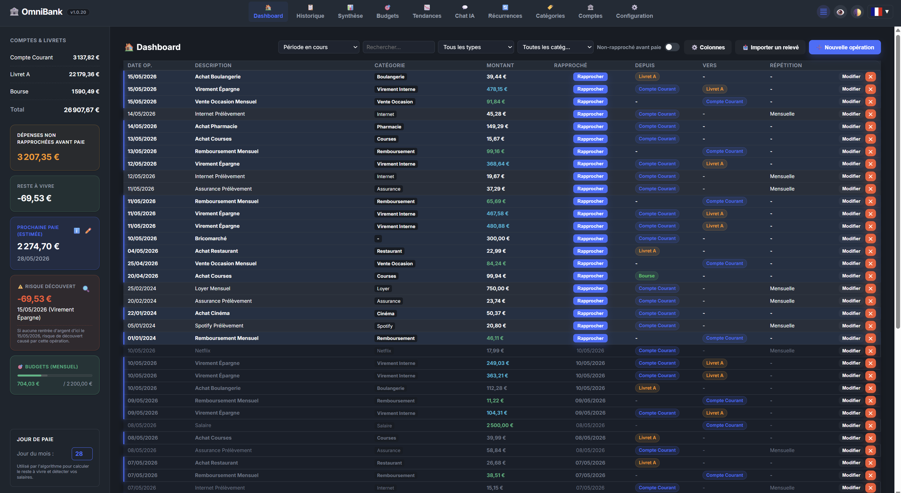

> [!CAUTION]
> **Avertissement** : La sécurité du code n'a pas fait l'objet d'un audit indépendant. Utilisez cette application à vos propres risques et uniquement dans un environnement local sécurisé.

---

## 🌟 Pourquoi OmniBank ?

*   **🔒 Confidentialité Absolue (Zéro Cloud)** : Vos données financières ne quittent jamais votre machine. Tout est stocké localement dans une base SQLite.
*   **🤖 Assistant IA Local (Ollama)** : Interagissez avec vos finances en langage naturel. Catégorisation intelligente, analyses de tendances et conseils personnalisés sans compromettre votre vie privée.
*   **⚡ Performance Extrême** : Grâce au rendu virtualisé, gérez des milliers de transactions sans aucun ralentissement.
*   **🎯 Gestion par Enveloppes** : Un système budgétaire visuel et intuitif pour suivre vos projets et vos dépenses courantes.

---

## ✨ Fonctionnalités Clés

### 🏗️ Configuration Simplifiée (Setup Wizard)
Dès le premier lancement, un **Assistant d'Initialisation** vous guide pour configurer vos comptes, vos préférences et connecter votre instance Ollama.


### 📈 Analytique & Gestion Quotidienne
*   **Tableau de Bord Dynamique** : Une vue d'ensemble de vos soldes, de vos budgets et de vos prochaines échéances.
*   **Historique Virtualisé** : Gérez des milliers de transactions avec une fluidité parfaite grâce au rendu ultra-rapide.
*   **Rapprochement Intelligent** : Un système visuel pour pointer vos opérations. Comparez d'un coup d'œil vos relevés bancaires (avant) et votre comptabilité propre (après).

| Saisie d'opération | Historique | Rapprochement |
| :---: | :---: | :---: |
| 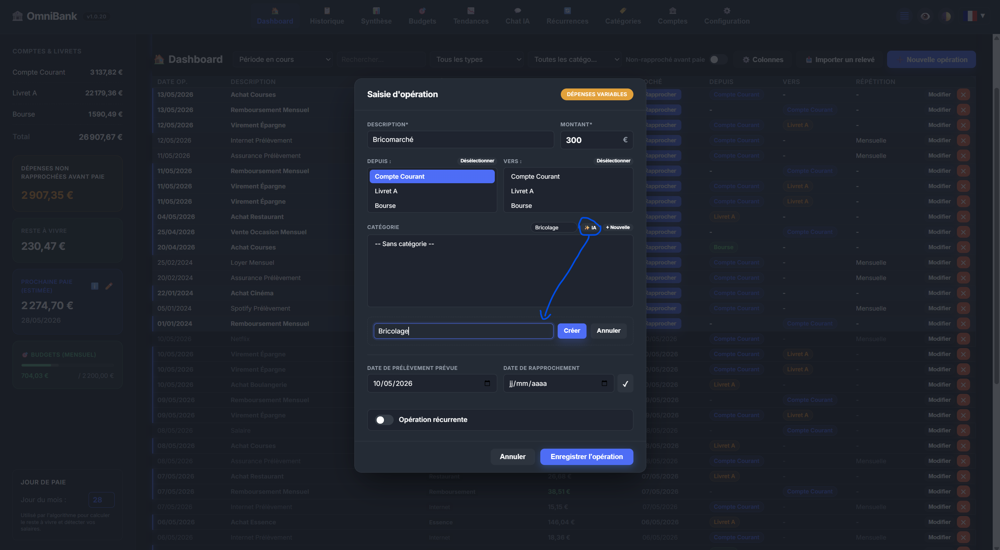 | 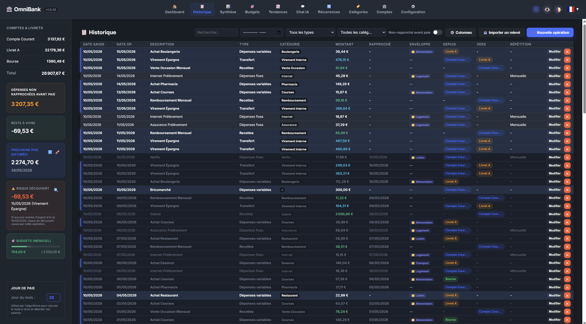 | 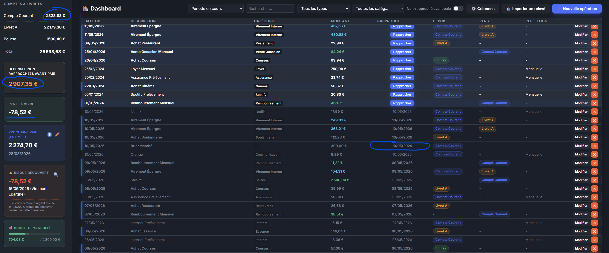 |

### 🎯 Budget & Enveloppes
Suivez vos dépenses par catégories ou par projets avec un système d'enveloppes visuel. L'IA peut même vous suggérer des budgets basés sur vos habitudes.

| Vue Budget | Détail Budget | Suggestions IA |
| :---: | :---: | :---: |
| 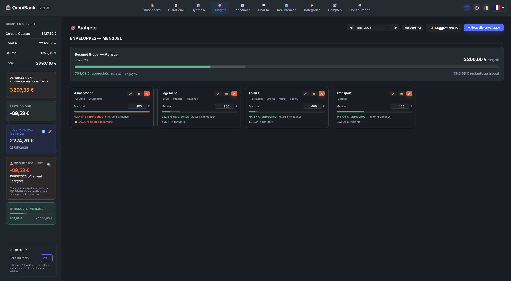 | 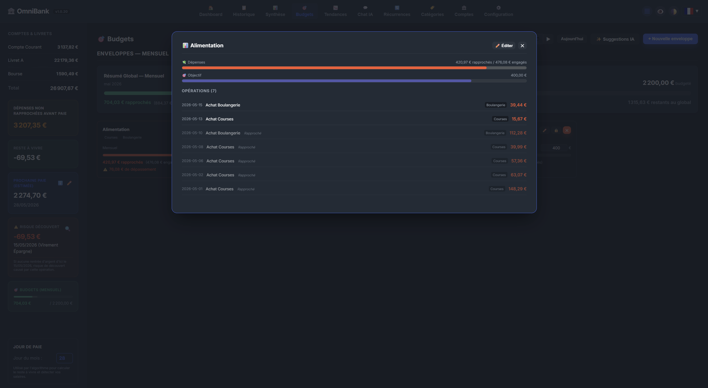 | 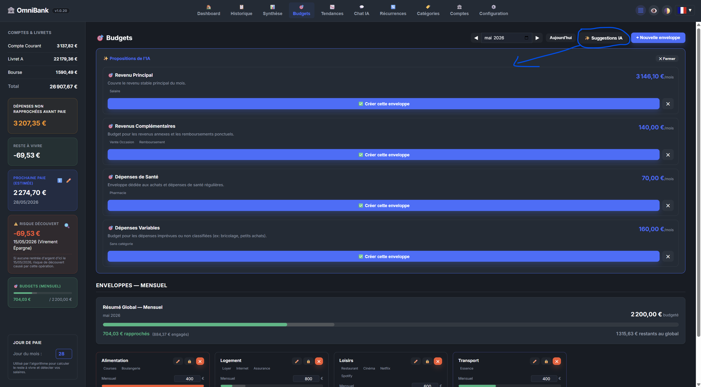 |

### 🤖 Intelligence Artificielle Locale
Interagissez avec votre assistant financier personnel via Ollama. Grâce au RAG (Retrieval-Augmented Generation), l'IA accède à vos données pour répondre précisément. Elle peut même vous soumettre des **propositions d'actions interactives** directement dans le chat.

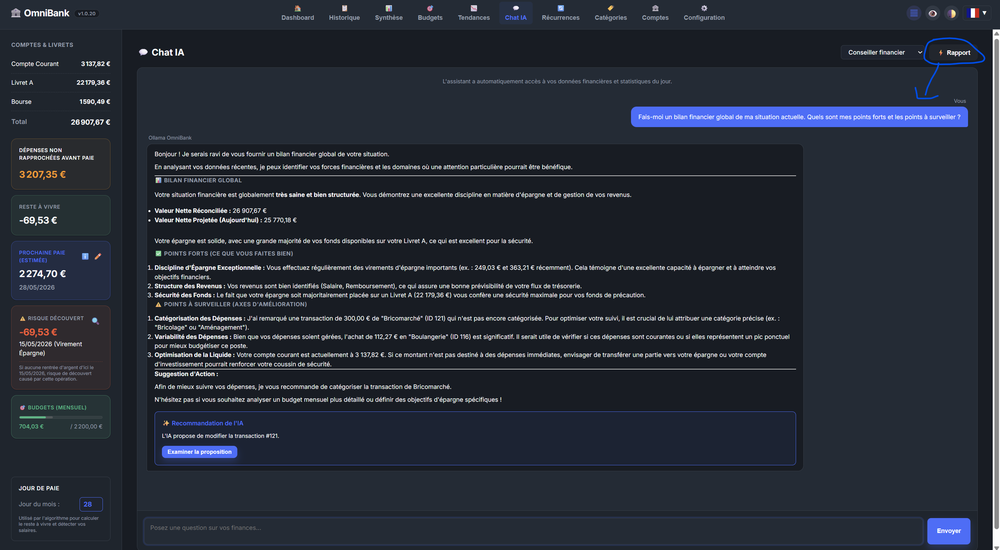

### 📊 Synthèse & Tendances
Visualisez l'évolution de votre patrimoine et générez des **rapports PDF haute fidélité**, parfaits pour un suivi comptable rigoureux ou un partage sécurisé.

| Synthèse | Tendances | Export PDF |
| :---: | :---: | :---: |
| 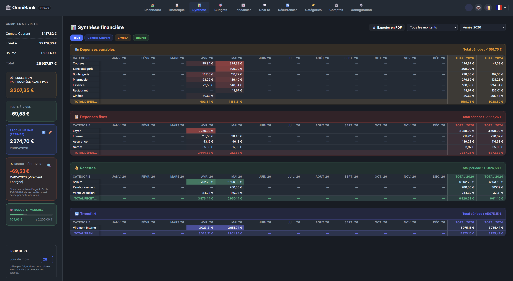 | 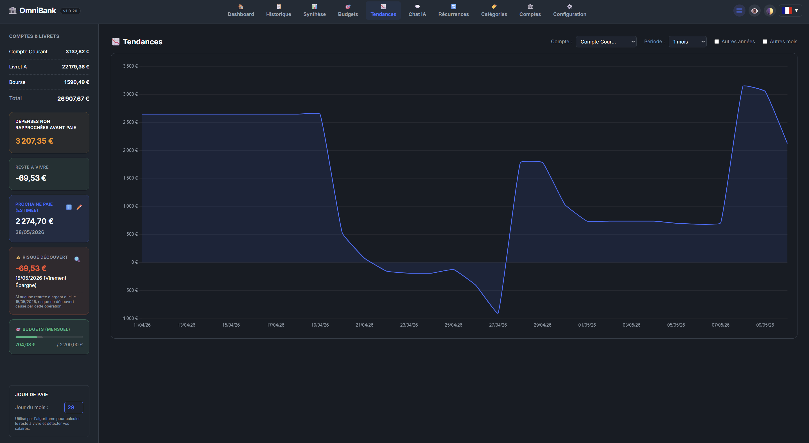 | 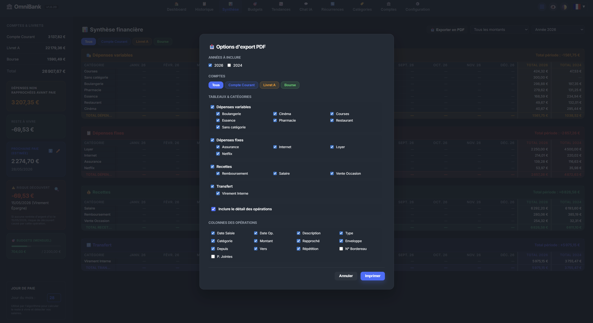 |

### 🛠️ Administration & Personnalisation
Prenez le contrôle total de votre structure financière avec des outils de gestion flexibles.

| Comptes | Catégories | Récurrences | Configuration |
| :---: | :---: | :---: | :---: |
| 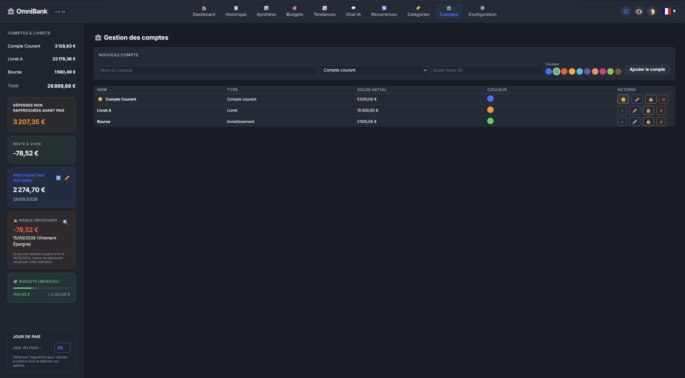 | 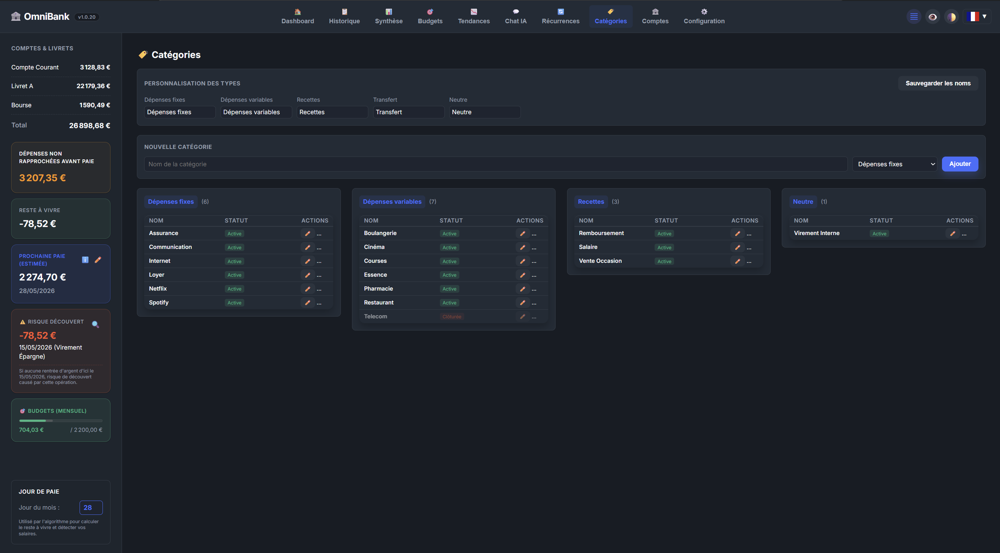 | 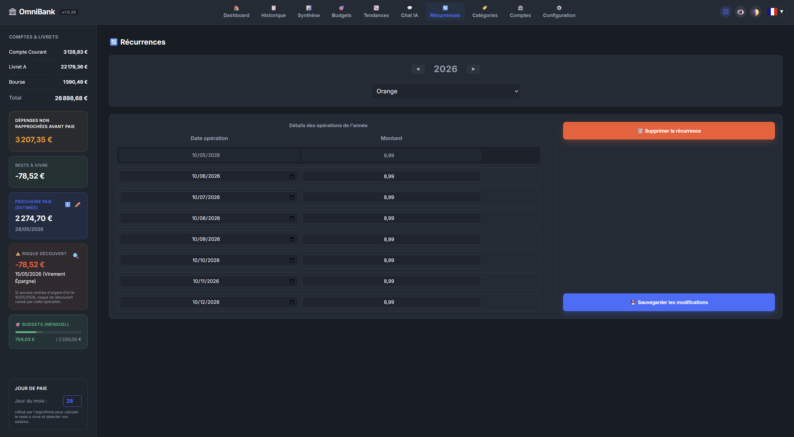 | 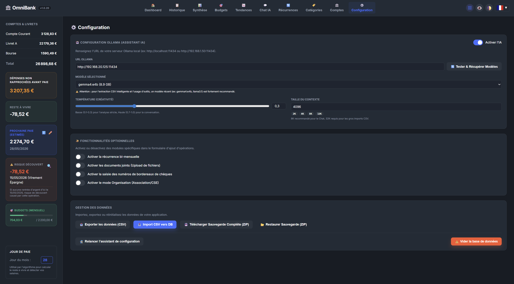 |

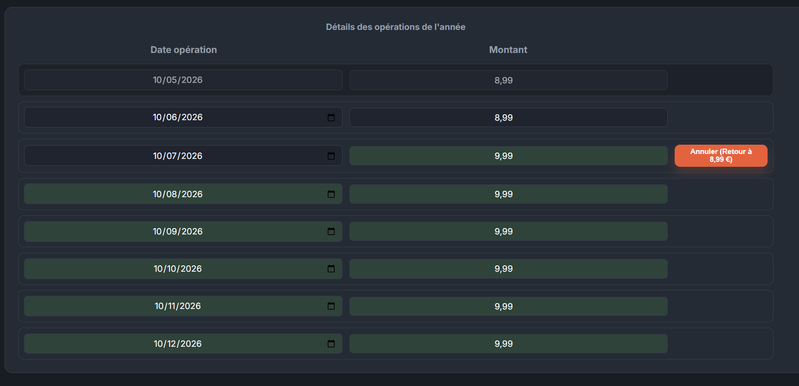

---

## 🏢 Mode Organisation (Associations / CSE)

OmniBank propose un **mode organisation** conçu pour les associations, comités d'entreprise (CSE) et petites structures ayant besoin d'un suivi multi-utilisateur.

*   **👥 Multi-utilisateur sans mot de passe** : Chaque membre (trésorier, adjoint, secrétaire…) sélectionne son profil au lancement.
*   **📋 Audit intégré** : Chaque opération enregistre automatiquement qui l'a créée et qui l'a modifiée en dernier.
*   **🔑 Licence requise** : L'activation du mode organisation nécessite une clé de licence.

> Pour obtenir une licence, ouvrez une **[Issue sur GitHub](https://github.com/Aschefr/OmniBank-Local/issues)**.

---

## 🚀 Installation

### 🖥️ Windows (Recommandé)
Téléchargez le dernier installateur `.msi` depuis la page des [Releases](https://github.com/Aschefr/OmniBank-Local/releases).

### 🐳 Docker
```bash
docker-compose up -d --build
```
Accédez à l'interface sur `http://localhost:8434`.

---

## 🛠 Stack Technique

*   **Backend** : Python (FastAPI), SQLAlchemy, Pandas.
*   **Frontend** : HTML5/CSS3 (Vanilla), JavaScript, Chart.js.
*   **Desktop** : Tauri (Wrapper Rust).
*   **IA** : Ollama (Support Texte & Vision).

---

## 🆕 Dernières Mises à Jour (v1.0.46)

*   **🔧 Correctif Sidebar — Montant "Dépenses non rapprochées avant paie"** : Le montant affiché dans l'encart du bandeau latéral gauche excluait incorrectement les virements internes (ex : Virement vers livret, virement entre comptes), provoquant un écart avec le total affiché dans l'onglet Historique. Les deux valeurs sont désormais cohérentes.

## 🆕 Dernières Mises à Jour (v1.0.45)

*   **🔧 Correctif critique — Récurrences dupliquées** : Correction d'un bug majeur où la clôture du mois courant générait des dizaines d'opérations récurrentes en doublon pour des templates abandonnés ou désactivés.
*   **🧹 Détection enrichie des orphelins** : Le bouton de nettoyage des récurrences orphelines détecte désormais 4 familles de doublons :
    * **Templates abandonnés** (actifs mais sans activité en N-1 et N).
    * **Templates vidés à zéro** (3+ derniers rapprochements à 0 €, abonnement résilié sans clôture).
    * **Doublons annuels** (occurrence supplémentaire pour une récurrence annuelle déjà rapprochée dans l'année).
    * **Doublons mensuels** (deux instances non rapprochées le même mois).
*   **🐛 Correctif Dashboard** : Les opérations non rapprochées de la période courante + l'offset de jours (5/15/30) sélectionné sont désormais correctement affichées (seules les opérations non rapprochées étaient auparavant visibles).

## 🆕 Dernières Mises à Jour (v1.0.41)

*   **⚙️ Colonnes de totaux configurables** : Ajout d'un bouton "⚙️ Années" sur la page Synthèse permettant de sélectionner les colonnes de totaux annuels à afficher, avec une synchronisation automatique et bidirectionnelle avec l'export PDF.
*   **🎨 Contrôle du gradient de couleur** : Ajout d'un slider par tableau sur la page Synthèse pour basculer et ajuster finement le gradient (Logarithmique, Proportionnel, Exponentiel).
*   **📅 Améliorations de la Paye** :
    * Le bouton de transition manuelle a été renommé en "Clôturer le mois en cours" pour plus de clarté.
    * Le bouton superflu "Corriger la paie" a été retiré du bandeau bleu du Dashboard.

## 🆕 Dernières Mises à Jour (v1.0.36)

*   **📦 Correctif de publication** : Correction d'un problème dans le script de build qui empaquetait d'anciens fichiers (mode onedir) au lieu des fichiers à jour.

## 🆕 Dernières Mises à Jour (v1.0.35)

*   **⚙️ Paramètres de sauvegarde intelligents** : L'encart de configuration des sauvegardes automatiques se replie dynamiquement lorsque la fonctionnalité est désactivée, allégeant ainsi l'interface des paramètres.
*   **🔙 Navigation fluide (Drill-down)** : Ajout d'un bouton "Retour" contextuel dans l'Historique qui n'apparaît que lors de l'accès depuis une cellule du tableau de Synthèse, permettant de revenir instantanément à vos analyses.
*   **📊 Affichage Synthèse optimisé** : Correction du tronquage (points de suspension) des en-têtes d'année ("TOT. 2026"). L'année est désormais toujours visible, s'adaptant sur deux lignes en mode normal et restant strictement sur une seule ligne en mode compact.

## 🆕 Dernières Mises à Jour (v1.0.34)

*   **⚡ Démarrage Instantané (onedir)** : Optimisation majeure du temps de lancement de l'application. Le backend Python n'a plus besoin de s'extraire à chaque démarrage, rendant l'ouverture d'OmniBank quasi instantanée.

## 🆕 Dernières Mises à Jour (v1.0.33)

*   **🧹 Nettoyage de Base de Données** : Ajout d'un outil de maintenance permettant de nettoyer les récurrences orphelines avec une validation granulaire (opération par opération).
*   **🐛 Correctif** : Résolution d'une régression liée à la gestion des opérations récurrentes.

## 🆕 Dernières Mises à Jour (v1.0.32)

*   **🤖 Import IA en arrière-plan** : L'analyse IA des relevés bancaires peut désormais s'exécuter en arrière-plan. Si l'analyse dépasse 5 secondes, la modale se masque automatiquement et un toast notifie l'utilisateur une fois terminé. Le bouton d'import affiche une animation pendant l'analyse et pulse en vert quand le résultat est prêt.
*   **🎨 Polish visuel** : Header sticky corrigé (le tableau ne « glisse » plus sous les filtres), scrollbar fine et discrète sur la zone principale, animation du bouton IA sans changement de largeur.
*   **📱 Fix mobile** : Virtualisation du tableau désactivée sur mobile (≤768px) pour éliminer les saccades de scroll en mode carte.
*   **🔍 Filtre Récurrences** : Ajout d'un champ de recherche dans la page des récurrences.
*   **🌍 Traductions** : Corrections de phrases non traduites en anglais.

---

# 🇺🇸 English

[](https://github.com/Aschefr/OmniBank-Local/releases)
[](https://amify-studio.fr)
[](#)

**OmniBank Local** is an ultra-private personal and organizational finance management solution, designed for those who demand total control over their data. Combining spreadsheet-like power with local AI intelligence, it transforms financial management into a smooth and secure experience.


> [!CAUTION]
> **Disclaimer**: The code's security has not undergone any independent audit. Use this application at your own risk and only in a secure local environment.

---

## 🌟 Why OmniBank?

*   **🔒 Absolute Privacy (Zero Cloud)**: Your financial data never leaves your machine. Everything is stored locally in a SQLite database.
*   **🤖 Local AI Assistant (Ollama)**: Interact with your finances using natural language. Intelligent categorization, trend analysis, and personalized advice without compromising your privacy.
*   **⚡ Extreme Performance**: Thanks to virtualized rendering, manage thousands of transactions without any slowdown.
*   **🎯 Envelope Management**: A visual and intuitive budgeting system to track your projects and daily expenses.

---

## ✨ Key Features

### 🏗️ Simplified Setup (Setup Wizard)
From the very first launch, an **Initialization Assistant** guides you through configuring your accounts, preferences, and connecting your Ollama instance.


### 📈 Analytics & Daily Management
*   **Dynamic Dashboard**: An overview of your balances, budgets, and upcoming deadlines.
*   **Virtualized History**: Manage thousands of transactions with perfect fluidity thanks to ultra-fast rendering.
*   **Smart Reconciliation**: A visual system to check your operations. Compare bank statements (before) and your clean accounting (after) at a glance.

| Transaction entry | History | Reconciliation |
| :---: | :---: | :---: |
|  |  |  |

### 🎯 Budget & Envelopes
Track your spending by categories or projects with a visual envelope system. The AI can even suggest budgets based on your habits.

| Budget View | Budget Detail | AI Suggestions |
| :---: | :---: | :---: |
|  |  |  |

### 🤖 Local AI Assistant
Interact with your personal financial assistant via Ollama. Using RAG (Retrieval-Augmented Generation), the AI accesses your data to provide precise answers. It can even submit **interactive action proposals** directly in the chat.


### 📊 Synthesis & Trends
Visualize the evolution of your wealth and generate **high-fidelity PDF reports**, perfect for rigorous accounting tracking or secure sharing.

| Synthesis | Trends | PDF Export |
| :---: | :---: | :---: |
|  |  |  |

### 🛠️ Administration & Customization
Take full control of your financial structure with flexible management tools.

| Accounts | Categories | Recurrences | Configuration |
| :---: | :---: | :---: | :---: |
|  |  |  |  |


---

## 🏢 Organisation Mode (Nonprofits / Work Councils)

OmniBank offers an **organisation mode** designed for nonprofits, work councils, and small organizations needing multi-user tracking.

*   **👥 Password-free multi-user**: Each member (treasurer, deputy, secretary…) selects their profile at launch.
*   **📋 Built-in audit trail**: Every transaction automatically records who created it and who last modified it.
*   **🔑 License required**: Activating organisation mode requires a license key.

> To obtain a license, open an **[Issue on GitHub](https://github.com/Aschefr/OmniBank-Local/issues)**.

---

## 🚀 Installation

### 🖥️ Windows (Recommended)
Download the latest `.msi` installer from the [Releases](https://github.com/Aschefr/OmniBank-Local/releases) page.

### 🐳 Docker
```bash
docker-compose up -d --build
```
Access the interface at `http://localhost:8434`.

---

## 🛠 Technical Stack

*   **Backend**: Python (FastAPI), SQLAlchemy, Pandas.
*   **Frontend**: HTML5/CSS3 (Vanilla), JavaScript, Chart.js.
*   **Desktop**: Tauri (Rust Wrapper).
*   **AI**: Ollama (Text & Vision Support).

---

## 🆕 Recent Updates (v1.0.46)

*   **🔧 Sidebar Fix — "Unreconciled expenses before pay" amount**: The amount shown in the left sidebar widget incorrectly included internal transfers (e.g., transfers to savings accounts), causing a discrepancy with the total displayed in the History tab. Both values are now consistent.

## 🆕 Recent Updates (v1.0.45)

*   **🔧 Critical Fix — Duplicate Recurring Transactions**: Fixed a major bug where closing the current month generated dozens of duplicate recurring transactions for abandoned or deactivated templates.
*   **🧹 Enhanced Orphan Detection**: The orphan recurrence cleanup button now detects 4 types of duplicates:
    * **Abandoned templates** (still active but no activity in year N-1 or N).
    * **Zeroed-out templates** (last 3+ reconciled entries at €0, subscription cancelled without closing the template).
    * **Yearly duplicates** (a second unreconciled instance exists for a yearly template already reconciled this year).
    * **Monthly duplicates** (two unreconciled instances for the same month).
*   **🐛 Dashboard Fix**: Unreconciled transactions for the current period are now correctly displayed alongside the user-selected day offset (5/15/30 days), instead of showing only unreconciled transactions.

## 🆕 Recent Updates (v1.0.41)

*   **⚙️ Customizable Totals Columns**: Added a "⚙️ Years" button on the Synthesis page to select which annual totals columns are displayed, with automatic two-way mirroring to the PDF export options.
*   **🎨 Table Color Gradient Slider**: Added a slider to each Synthesis table header to customize color intensity (Logarithmic, Proportional, Exponential).
*   **📅 Paycheck Flow Enhancements**:
    * Renamed the manual skip button to "Close current month" for better clarity.
    * Removed the duplicate "Correct pay" button from the Dashboard banner.

## 🆕 Recent Updates (v1.0.36)

*   **📦 Release Hotfix**: Fixed a bug in the automated release script where older backend files (onedir bundle) were packaged instead of the latest code.

## 🆕 Recent Updates (v1.0.35)

*   **⚙️ Smart Backup Settings**: The auto-backup configuration section now dynamically hides when the feature is disabled, reducing visual clutter in the settings.
*   **🔙 History Drill-down Navigation**: Added a contextual "Back" button in the History view that appears exclusively when drilling down from the Synthesis table, allowing for seamless return to your analytics.
*   **📊 Synthesis Table Polish**: Fixed the truncation of the "Total Year" column headers. The year is now always fully visible, intelligently adapting to two lines in normal mode and remaining strictly on one line in compact mode.

## 🆕 Recent Updates (v1.0.34)

*   **⚡ Instant Startup (onedir)**: Major optimization of the application's launch time. The Python backend no longer needs to extract itself on every startup, making OmniBank open almost instantly.

## 🆕 Recent Updates (v1.0.33)

*   **🧹 Database Cleanup**: Added a maintenance tool to clean up orphaned recurring operations with granular, per-operation validation.
*   **🐛 Bug Fix**: Fixed a regression related to the handling of recurring operations.

## 🆕 Recent Updates (v1.0.32)

*   **🤖 Background AI Import**: Bank statement AI analysis now runs in the background. If analysis takes more than 5 seconds, the modal auto-hides and a toast notification alerts you when results are ready. The import button shows a sweep animation during analysis and pulses green when complete.
*   **🎨 Visual Polish**: Fixed sticky header (table rows no longer slide under filters), thin discreet scrollbar on main content area, button animation without width change.
*   **📱 Mobile Fix**: Virtual table scrolling disabled on mobile (≤768px) to eliminate scroll jank in card layout mode.
*   **🔍 Recurrence Filter**: Added a search field to the recurrences management page.
*   **🌍 Translations**: Fixed untranslated phrases in English.

---

1. `python -m venv venv`
2. `.\venv\Scripts\activate`
3. `pip install -r requirements.txt`
4. `uvicorn app.main:app --host 127.0.0.1 --port 8434 --reload`

---

## 📝 License
© 2026 Amify Studio — All rights reserved.
